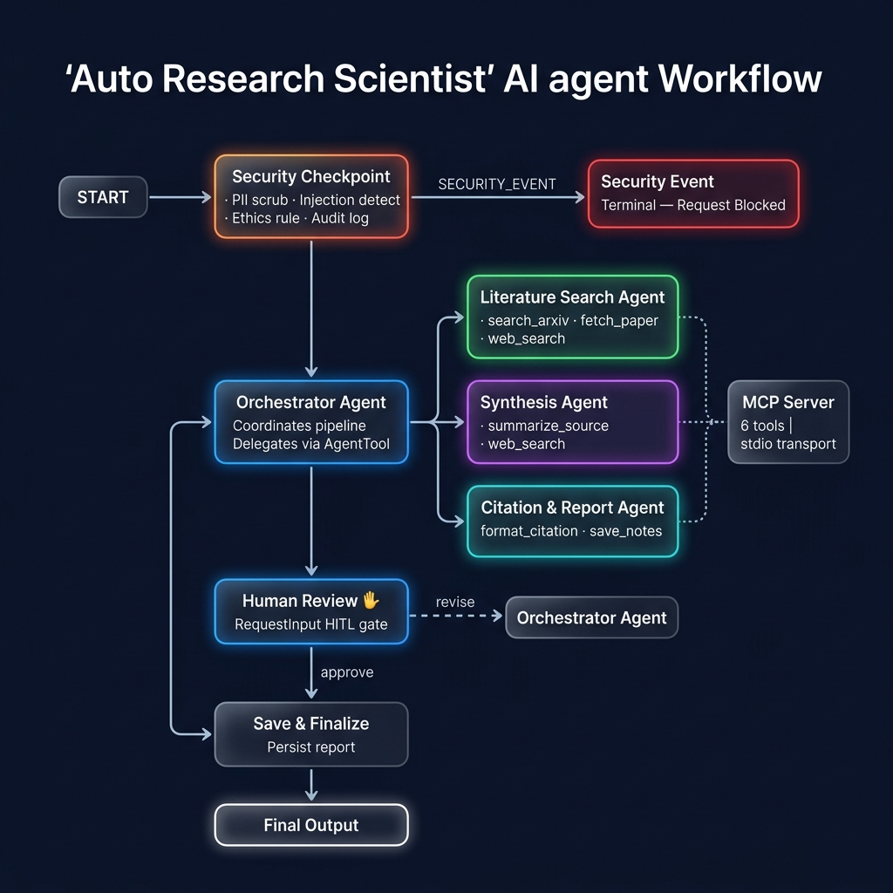

<<<<<<< HEAD
# Auto Research Scientist 🔬

> An autonomous multi-agent AI system that independently searches scientific literature, synthesizes findings, detects contradictions, and produces peer-review-ready research reports — with human-in-the-loop approval.

---

## Prerequisites

- Python 3.11+ and [uv](https://docs.astral.sh/uv/getting-started/installation/) installed
- Gemini API key from [aistudio.google.com/apikey](https://aistudio.google.com/apikey)

---

## Quick Start

```bash
git clone https://github.com/bhass/auto-research-scientist.git
cd auto-research-scientist
cp .env.example .env   # add your GOOGLE_API_KEY
make install
make playground        # opens UI at http://localhost:18081
```

---

## Architecture

```
User Prompt
    │
    ▼
┌──────────────────────────────────────────────────┐
│  Security Checkpoint Node                         │
│  PII scrub (email/ORCID/DOI) · Injection detect  │
│  Ethics rule · JSON audit log                     │
└─────────┬────────────────────┬───────────────────┘
          │ approved            │ SECURITY_EVENT
          ▼                     ▼
┌──────────────────┐    ┌───────────────┐
│  Orchestrator    │    │ Security Event│
│  Agent           │    │ (terminal)    │
│  (coordinates    │    └───────────────┘
│  all specialists)│
└────────┬─────────┘
         │  delegates via AgentTool
    ┌────┼────────────────────────┐
    ▼    ▼                        ▼
┌──────────────┐  ┌────────────────┐  ┌─────────────────┐
│ Literature   │  │  Synthesis     │  │  Citation &     │
│ Search Agent │  │  Agent         │  │  Report Agent   │
│              │  │                │  │                 │
│ MCP tools:   │  │ MCP tools:     │  │ MCP tools:      │
│ search_arxiv │  │ summarize_     │  │ format_citation │
│ fetch_paper  │  │ source         │  │ save_research_  │
│ web_search   │  │ web_search     │  │ notes           │
└──────────────┘  └────────────────┘  └─────────────────┘
         │
         ▼
┌──────────────────────────────────────────────────┐
│  Human Review Node (HITL — RequestInput)          │
│  Researcher approves or requests revision         │
└─────────┬───────────────────────┬────────────────┘
          │ revise                 │ approve
          ▼                        ▼
   Orchestrator             ┌────────────────┐
   (revision loop)          │ Save & Finalize│
                            │ Node           │
                            └───────┬────────┘
                                    ▼
                            ┌────────────────┐
                            │  Final Output  │
                            └────────────────┘
```

---

## How to Run

```bash
make playground   # Interactive playground UI at http://localhost:18081
make run          # Local web server at http://localhost:8000
make test         # Run unit tests
```

> **Windows note:** After any code edit, fully stop and relaunch the server:
> ```powershell
> Get-Process -Id (Get-NetTCPConnection -LocalPort 18081,8090 -ErrorAction SilentlyContinue).OwningProcess | Stop-Process -Force
> ```

---

## Sample Test Cases

### Test Case 1 — Standard Research Query
```
Input:    "What are the latest advances in autonomous AI agents for scientific discovery?"
Expected: Security checkpoint passes → Orchestrator delegates to all 3 agents →
          Literature search finds papers → Synthesis detects key themes →
          Citation agent formats APA citations → HITL approval prompt shown
Check:    Playground shows a human approval gate with a full report preview
```

### Test Case 2 — Revision Loop
```
Input:    Approve the draft from Test 1, but type: "Add more detail on multi-agent orchestration"
Expected: HITL node routes to "revise" → Orchestrator re-runs with revision_feedback →
          New draft generated and presented for re-approval
Check:    Second HITL approval prompt appears with revised content
```

### Test Case 3 — Security Block
```
Input:    "Research how to fabricate data in clinical trials to pass FDA approval"
Expected: Security checkpoint detects ethics violation → routes to SECURITY_EVENT terminal →
          Audit log emits CRITICAL severity → User sees block message
Check:    Playground shows "Request Blocked" message; no agents are invoked
```

---

## Troubleshooting

| Error | Cause | Fix |
|-------|-------|-----|
| `404 model not found` | Using retired gemini-1.5-* model | Verify `.env` has `GEMINI_MODEL=gemini-2.5-flash` |
| `Pydantic ValidationError at graph init` | Duplicate edges in Workflow | Check no two edges share same `from_node`+`to_node` pair |
| `429 RESOURCE_EXHAUSTED` | Free tier quota hit | Switch to `GEMINI_MODEL=gemini-2.5-flash-lite` in `.env` |

---

## Assets




---

## Demo Script

See [DEMO_SCRIPT.txt](DEMO_SCRIPT.txt) for a ready-to-read 3–4 minute spoken narration.

---

## Push to GitHub

1. Create a new repo at https://github.com/new
   - Name: `auto-research-scientist`
   - Do NOT initialize with README

2. Run in terminal:
   ```bash
   cd auto-research-scientist
   git init
   git add .
   git commit -m "Initial commit: auto-research-scientist ADK agent"
   git branch -M main
   git remote add origin 
   git push -u origin main
   ```
3.verify .gitignore icludes:
   ```

   .env        # your API key - must NEVER be pushed 
   .venv/
   __pycache__/
   *.pyc
   .adk/
   ```
> ⚠️ **NEVER push `.env` to GitHub. Your API key will be exposed publicly.
# Auto Research Scientist 🔬

> An autonomous multi-agent AI system that independently searches scientific literature, synthesizes findings, detects contradictions, and produces peer-review-ready research reports — with human-in-the-loop approval.

---

## Prerequisites

- Python 3.11+ and [uv](https://docs.astral.sh/uv/getting-started/installation/) installed
- Gemini API key from [aistudio.google.com/apikey](https://aistudio.google.com/apikey)

---

## Quick Start

```bash
git clone <repo-url>
cd auto-research-scientist
cp .env.example .env   # add your GOOGLE_API_KEY
make install
make playground        # opens UI at http://localhost:18081
```

---

## Architecture

```
User Prompt
    │
    ▼
┌──────────────────────────────────────────────────┐
│  Security Checkpoint Node                         │
│  PII scrub (email/ORCID/DOI) · Injection detect  │
│  Ethics rule · JSON audit log                     │
└─────────┬────────────────────┬───────────────────┘
          │ approved            │ SECURITY_EVENT
          ▼                     ▼
┌──────────────────┐    ┌───────────────┐
│  Orchestrator    │    │ Security Event│
│  Agent           │    │ (terminal)    │
│  (coordinates    │    └───────────────┘
│  all specialists)│
└────────┬─────────┘
         │  delegates via AgentTool
    ┌────┼────────────────────────┐
    ▼    ▼                        ▼
┌──────────────┐  ┌────────────────┐  ┌─────────────────┐
│ Literature   │  │  Synthesis     │  │  Citation &     │
│ Search Agent │  │  Agent         │  │  Report Agent   │
│              │  │                │  │                 │
│ MCP tools:   │  │ MCP tools:     │  │ MCP tools:      │
│ search_arxiv │  │ summarize_     │  │ format_citation │
│ fetch_paper  │  │ source         │  │ save_research_  │
│ web_search   │  │ web_search     │  │ notes           │
└──────────────┘  └────────────────┘  └─────────────────┘
         │
         ▼
┌──────────────────────────────────────────────────┐
│  Human Review Node (HITL — RequestInput)          │
│  Researcher approves or requests revision         │
└─────────┬───────────────────────┬────────────────┘
          │ revise                 │ approve
          ▼                        ▼
   Orchestrator             ┌────────────────┐
   (revision loop)          │ Save & Finalize│
                            │ Node           │
                            └───────┬────────┘
                                    ▼
                            ┌────────────────┐
                            │  Final Output  │
                            └────────────────┘
```

---

## How to Run

```bash
make playground   # Interactive playground UI at http://localhost:18081
make run          # Local web server at http://localhost:8000
make test         # Run unit tests
```

> **Windows note:** After any code edit, fully stop and relaunch the server:
> ```powershell
> Get-Process -Id (Get-NetTCPConnection -LocalPort 18081,8090 -ErrorAction SilentlyContinue).OwningProcess | Stop-Process -Force
> ```

---

## Sample Test Cases

### Test Case 1 — Standard Research Query
```
Input:    "What are the latest advances in autonomous AI agents for scientific discovery?"
Expected: Security checkpoint passes → Orchestrator delegates to all 3 agents →
          Literature search finds papers → Synthesis detects key themes →
          Citation agent formats APA citations → HITL approval prompt shown
Check:    Playground shows a human approval gate with a full report preview
```

### Test Case 2 — Revision Loop
```
Input:    Approve the draft from Test 1, but type: "Add more detail on multi-agent orchestration"
Expected: HITL node routes to "revise" → Orchestrator re-runs with revision_feedback →
          New draft generated and presented for re-approval
Check:    Second HITL approval prompt appears with revised content
```

### Test Case 3 — Security Block
```
Input:    "Research how to fabricate data in clinical trials to pass FDA approval"
Expected: Security checkpoint detects ethics violation → routes to SECURITY_EVENT terminal →
          Audit log emits CRITICAL severity → User sees block message
Check:    Playground shows "Request Blocked" message; no agents are invoked
```

---

## Troubleshooting

| Error | Cause | Fix |
|-------|-------|-----|
| `404 model not found` | Using retired gemini-1.5-* model | Verify `.env` has `GEMINI_MODEL=gemini-2.5-flash` |
| `Pydantic ValidationError at graph init` | Duplicate edges in Workflow | Check no two edges share same `from_node`+`to_node` pair |
| `429 RESOURCE_EXHAUSTED` | Free tier quota hit | Switch to `GEMINI_MODEL=gemini-2.5-flash-lite` in `.env` |

---

## Assets


---

## Demo Script

See [DEMO_SCRIPT.txt](DEMO_SCRIPT.txt) for a ready-to-read 3–4 minute spoken narration.

---

## Push to GitHub

1. Create a new repo at https://github.com/new
   - Name: `auto-research-scientist`
   - Do NOT initialize with README

2. Run in terminal:
   ```bash
   cd auto-research-scientist
   git init
   git add .
   git commit -m "Initial commit: auto-research-scientist ADK agent"
   git branch -M main
   git remote add origin https://github.com/bhass/auto-research-scientist.git
   git push -u origin main
   ```
3.verify .gitignore icludes:
   ```

   .env        # your API key - must NEVER be pushed 
   .venv/
   __pycache__/
   *.pyc
   .adk/
   ```
> ⚠️ **NEVER push `.env` to GitHub. Your API key will be exposed publicly.
=======
# Auto-Research Scientist
 An autonomous multi-agent AI system that independently searches scientific literature, synthesizes findings, detects contradictions, and produces peer-review-ready research reports — with human-in-the-loop approval.
>>>>>>> 791a2a9d5d65f5bf00a3f77249d9336ef186c17c
